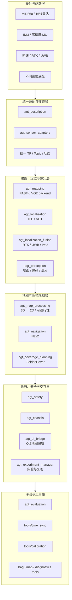
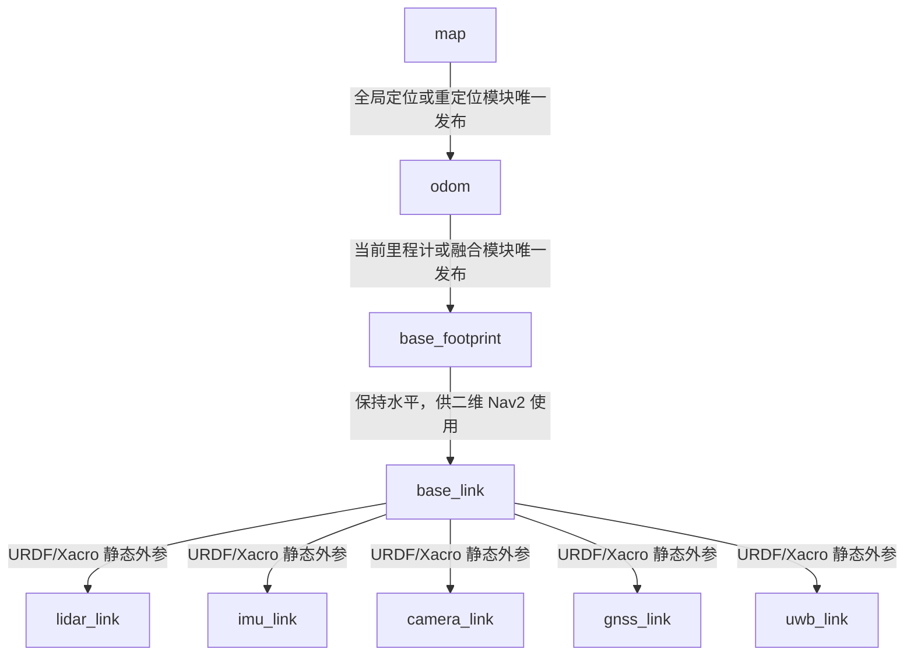

# agt_navigation_v2

## 模块化农业机器人导航实验平台

**文档类型：** 项目总体方案与仓库迁移汇报稿  
**当前基准：** MID360 + FAST-LIVO2-ROS2 + Nav2  
**面向扩展：** 16线雷达 / 高精度IMU / RTK / UWB / 语义点云 / Fields2Cover

> **Codex 读取说明**  
> 本文件是项目方案的主上下文文档。代码迁移时应同时读取仓库根目录 `AGENTS.md`、`docs/interfaces/` 和 `docs/migration/migration_matrix.md`；不得仅根据本汇报稿一次性重写整个仓库。

项目负责人：yangxuan  
版本：V1.0  
日期：2026年7月

# 文档说明
| **项目** | **内容**                                                             |
|----------|----------------------------------------------------------------------|
| 文档名称 | agt_navigation_v2 项目总体方案与仓库迁移汇报稿                       |
| 文档目的 | 用于项目立项、阶段汇报、团队对齐以及 Codex 辅助迁移工作的统一依据    |
| 适用范围 | 仓库架构、系统接口、模块职责、配置治理、实验管理、迁移路线与未来扩展 |
| 当前状态 | 总体方案阶段；旧仓库保留为可运行基线，新仓库按模块逐步迁移           |
| 核心约束 | 不一次性重写；不破坏旧基线；每次迁移必须可验证、可回滚、可复现       |

## 建议汇报逻辑
1.  先说明旧仓库“能够运行但难以维护和开展对比实验”的现状。

2.  再说明新仓库不是重新造轮子，而是把已有成果整理为可替换、可复现的实验平台。

3.  随后用统一 TF、统一接口、模块边界和实验配置解释系统如何降低耦合。

4.  最后给出迁移路线、扩展方向和阶段性成果，说明方案具备可落地性。

> **一句话定位**  
> `agt_navigation_v2` 不是单一导航算法仓库，而是一套以 FAST-LIVO2-ROS2 为当前建图前端、以统一接口承载多传感器、多底盘、多地图处理和多规划算法实验的 ROS 2 模块化导航平台。

# 汇报摘要
当前 `ros2_3d-nav` ，文档位置在/home/yangxuan/ros2_ws，github版本在https://github.com/Aldoubt/ros2_3d-nav.git，已经形成 MID360 驱动、FAST-LIVO2 建图、点云地图导出、二维地图生成、ICP 重定位、Nav2、底盘桥接、安全急停、Qt5 上位机和实验记录等功能链。然而，第三方代码、自研模块、运行数据、启动逻辑和参数配置混杂，部分功能通过启动时动态修改 YAML 实现，同一地图或话题在不同入口中还存在不同默认值。系统虽具备样机能力，但继续叠加功能会显著增加排障、迁移和实验复现成本。

因此，新建 `agt_navigation_v2`，将旧仓库冻结为可运行基线，并按“接口先行、模块迁移、逐项验证”的方式重构。新平台以 MID360 和 FAST-LIVO2-ROS2 为第一阶段基准，但通过传感器适配层、建图后端接口、固定 TF 树和统一状态接口，避免上层模块直接依赖 FAST-LIVO2 的原生 topic、frame 和文件路径。

V2 的目标不是一次性接入所有算法，而是建立稳定的系统骨架：固定 TF 与底盘描述，形成三维点云到二维导航地图的可替换处理链，统一全局重定位和多源融合边界，建立静态全局地图与过滤后局部障碍点云相结合的 Nav2 架构，并通过实验管理器保存最终生效参数、Git 版本、bag 和评测结果。

| **维度** | **旧仓库主要状态**                | **V2 目标**                                    |
|----------|-----------------------------------|------------------------------------------------|
| 系统定位 | 功能样机与联调工作区              | 可扩展、可复现的导航实验平台                   |
| 算法关系 | FAST-LIVO2 原生接口被多处直接使用 | FAST-LIVO2 作为可替换 Mapping/Odometry Backend |
| TF       | 雷达坐标系与机器人基准耦合        | 固定 map→odom→base_footprint→base_link→sensor  |
| 地图处理 | OctoMap 固定高度投影为主          | 多后端统一输出，可开展对比实验                 |
| 配置     | 多个 YAML 和 launch 隐式覆盖      | 平台/传感器/环境/实验四层配置与最终参数快照    |
| 扩展     | 新增功能容易继续堆叠              | RTK、UWB、语义点云、Fields2Cover 按模块接入    |

> **核心决策**  
> 新建 `agt_navigation_v2`；旧仓库打 Tag 并保留维护分支；第三方算法单独 Fork 到个人 GitHub 命名空间，由 `nav_dependencies.repos` 固定版本拉取；V2 主仓库主要保存自研系统代码、配置、接口和文档。

# 1. 项目背景与重构动因
## 1.1 已有系统基础
- MID360 驱动与点云、IMU 数据接入。

- FAST-LIVO2-ROS2 在线里程计与三维点云建图。

- 全局 PCD 导出、OctoMap 二维投影地图保存。

- ICP 重定位与 `map → odom` 建立。

- Nav2 全局规划、局部控制和底盘速度桥接。

- 点云转 LaserScan 的前向障碍急停和速度安全仲裁。

- Qt5 地图交互、导航总控和实验记录工具。

## 1.2 当前主要矛盾
| **问题类别** | **具体表现**                                                                     | **直接影响**                         |
|--------------|----------------------------------------------------------------------------------|--------------------------------------|
| 职责混杂     | 第三方算法、驱动、自研节点、GUI、地图和日志放在同一工作区                        | 模块难以单独测试和迁移               |
| 接口耦合     | 上层模块直接使用 `/cloud_registered`、`/aft_mapped_to_init`、`livox_frame` | 更换雷达、LIO 或底盘需要连锁修改     |
| TF 不清晰    | 雷达 frame 被用作 Nav2 机器人基准                                                | 倾斜安装、Z 漂移和底盘迁移问题被放大 |
| 配置分散     | 多个 YAML、launch 参数、GUI 参数共同决定最终状态                                 | 排障时难以确认实际生效配置           |
| 地图能力不足 | 固定高度 OctoMap 投影不能区分地面、植被、噪声与硬障碍                            | 通道变窄、重影、误障碍               |
| 实验不可复现 | 地图、PCD、参数、Git 版本和 bag 缺少强绑定                                       | 对比实验可信度不足                   |

## 1.3 为什么采用新仓库而不是原地大改
旧仓库目前仍具有重要价值：它是一条真实运行过的系统基线，也是迁移过程中判断“新版本是否退化”的参照。若在旧仓库原地移动目录、重命名包并修改 TF，很容易同时破坏可运行链和新架构。V2 采用新仓库，可以把迁移任务控制在明确边界内，并随时与旧系统进行 bag 回放、话题输出和导航结果对比。

> **迁移策略**  
> 旧仓库负责“保留可运行能力和紧急修复”，V2 负责“建立正式架构和开展后续研究”。迁移完成前，两者并行存在，不要求一次切换。

# 2. 项目定位、目标与系统假设
## 2.1 项目定位
`agt_navigation_v2` 是一套面向农业移动机器人、温室与室外非结构化环境的 ROS 2 模块化导航实验平台。平台当前以 Livox MID360 和 FAST-LIVO2-ROS2 为基准，但不把某一具体雷达、SLAM、定位方法或底盘作为永久假设。

## 2.2 总体目标
- 形成可以在不同底盘、不同传感器和不同算法后端之间迁移的统一系统骨架。

- 把三维建图、二维地图处理、全局定位、多源融合、路径规划、控制与安全分层解耦。

- 为地图生成、定位、规划器、控制器和语义点云方法建立可重复的对比实验能力。

- 接入 Qt5 地图编辑工具和 Fields2Cover，支持农业覆盖作业边界、障碍物和路径编辑。

- 为 16 线激光雷达、高精度 IMU、RTK、UWB 和点云语义聚类预留明确模块边界。

- 利用 Codex 辅助代码迁移、文档维护、测试生成和回归检查，同时避免批量不可控重写。

## 2.3 当前与未来硬件假设
| **阶段** | **传感器/硬件**                            | **系统要求**                                         |
|----------|--------------------------------------------|------------------------------------------------------|
| 当前基准 | Livox MID360；当前 IMU；当前轮式底盘       | 完整跑通建图、地图处理、重定位、Nav2、安全和实验记录 |
| 硬件升级 | 16线机械式雷达；高精度 IMU；稳定轮速里程计 | 通过 adapter 和 profile 替换，不修改上层算法接口     |
| 全局约束 | RTK；UWB                                   | 统一坐标、杆臂、协方差、质量状态，并进入融合层       |
| 研究扩展 | 相机；语义点云；多模态感知                 | 作为可选 perception backend，不成为基础导航强依赖    |

## 2.4 设计原则
| **原则**   | **含义**                                                        |
|------------|-----------------------------------------------------------------|
| 接口先行   | 先定义 TF、topic、状态和地图格式，再迁移算法。                  |
| 单一责任   | 每个模块只承担一种核心职责，不在 GUI、launch 或适配器中堆算法。 |
| 后端可替换 | FAST-LIVO2、ICP、NDT、地图投影和控制器都通过统一接口替换。      |
| 配置可追溯 | 运行时必须保存最终生效参数，禁止依赖隐式覆盖。                  |
| 实验可复现 | 每次实验绑定地图、PCD、bag、Git commit、参数和指标。            |
| 安全独立   | 安全仲裁和急停不依赖 Nav2 是否正常运行。                        |
| 逐步迁移   | 每次只迁移一个模块，具备验证方法和回滚路径。                    |

# 3. 总体架构设计
系统采用分层架构：底层硬件通过适配层输出统一数据；建图、定位、融合和感知独立运行；地图处理与任务规划使用标准地图和路径接口；安全、底盘、UI 和实验管理位于系统边界。第三方算法不直接决定整套系统的数据命名和目录结构。




*图 1 agt_navigation_v2 总体分层架构*

## 3.1 关键数据主链
| **主链**   | **数据流**                                                             | **作用**                         |
|------------|------------------------------------------------------------------------|----------------------------------|
| 建图链     | 传感器 → adapter → FAST-LIVO2 backend → 统一里程计/注册点云/全局点云   | 建立连续局部坐标与三维地图       |
| 地图链     | 全局 PCD → map_processing backend → OccupancyGrid / TraversabilityGrid | 生成 Nav2 静态地图和可通行性代价 |
| 定位链     | 全局 PCD + 当前扫描 + 初值 → ICP/NDT → map→odom                        | 建立全局一致定位                 |
| 融合链     | LIO + 轮速 + IMU + RTK/UWB → EKF/UKF/因子图                            | 提升连续性和全局约束             |
| 导航链     | 静态全局地图 + 过滤后局部障碍 → Nav2 → 安全仲裁 → 底盘                 | 规划、控制、避障和执行           |
| 覆盖作业链 | 编辑边界/障碍/地头 → Fields2Cover → Path → Nav2/控制器                 | 农业作业路径生成与执行           |

## 3.2 基准架构与研究扩展的关系
第一阶段只要求 MID360 + FAST-LIVO2 + ICP + Nav2 的最小闭环稳定运行。RTK、UWB、语义点云和 Fields2Cover 在架构上预留接口与 package，但不在基础链尚未稳定时同时导入复杂依赖。这样可以避免“扩展功能越多，基础问题越难定位”。

# 4. 固定 TF 树与底盘迁移规范
V2 必须先固定 TF 语义。任何算法可以更换，但 TF 中每条变换的责任不能随意变化。Nav2 使用水平的 `base_footprint`，雷达实际安装角度通过 `base_link → lidar_link/livox_frame` 表达。




*图 2 固定 TF 树与发布责任*

## 4.1 发布责任约束
| **TF**                     | **唯一发布者**                     | **约束**                          |
|----------------------------|------------------------------------|-----------------------------------|
| map → odom                 | 全局重定位或全局融合模块           | 同一时刻只允许一个发布源          |
| odom → base_footprint      | 当前连续里程计或融合模块           | 不允许 FAST-LIVO2 与 EKF 同时发布 |
| base_footprint → base_link | 机器人描述或姿态适配模块           | 二维导航基准保持水平              |
| base_link → sensor         | URDF/Xacro + robot_state_publisher | 标定结果集中管理，不散落在 launch |

## 4.2 底盘迁移方式
不同底盘通过 `agt_description`、`profiles/platforms` 和 `agt_chassis` 组合适配。上层导航只依赖 `base_footprint`、真实 footprint、速度接口和底盘能力描述，不直接依赖某种 CAN 协议或底盘消息。

| **平台 Profile 内容** | **示例**                                                 |
|-----------------------|----------------------------------------------------------|
| 几何参数              | 长、宽、轴距、轮距、离地间隙、传感器安装位置             |
| 运动学能力            | 差速、Ackermann、履带；最小转弯半径；是否允许原地转向    |
| 碰撞模型              | 真实 footprint、扫掠面积、安全余量                       |
| 控制接口              | 输入 `/cmd_vel_safe`，输出 MK-mini/BUNKER/仿真底盘协议 |
| 安全限制              | 最大速度、最大角速度、制动距离、通信超时                 |

# 5. 仓库组织与模块职责
## 5.1 推荐顶层目录
```text
agt_navigation_v2/
├── docs/                    架构、接口、实验与迁移文档
├── profiles/                平台、传感器、环境和实验配置
├── src/                     自研 ROS 2 package
├── tools/                   离线时间同步、标定、bag、地图和诊断工具
├── tests/                   单元、集成、launch 与回归测试
├── runtime/                 地图、bag、日志和实验结果（默认不入 Git）
├── nav_dependencies.repos   第三方 fork 与固定版本
├── AGENTS.md                Codex/开发者工作约束
└── README.md                项目入口与最小运行说明
```

## 5.2 核心 package 划分
| **模块**                | **核心职责**                                | **明确不负责**      |
|-------------------------|---------------------------------------------|---------------------|
| agt_interfaces          | 统一 msg/srv/action、状态和能力描述         | 不实现算法          |
| agt_description         | URDF/Xacro、TF、footprint、传感器与底盘描述 | 不启动建图和导航    |
| agt_bringup             | 组合启动、生命周期与健康检查                | 不承载算法实现      |
| agt_sensor_adapters     | 不同传感器原生数据转统一接口                | 不修改上层算法      |
| agt_mapping             | FAST-LIVO2 等建图/里程计后端适配            | 不负责全局 map→odom |
| agt_map_processing      | PCD 到二维地图、可通行性地图、多后端对比    | 不负责实时导航控制  |
| agt_localization        | ICP/NDT/Scan Context 等全局重定位           | 不融合全部传感器    |
| agt_localization_fusion | LIO、轮速、IMU、RTK、UWB 融合               | 不生成导航路径      |
| agt_perception          | 地面、障碍、聚类、语义点云和可通行性        | 不直接控制底盘      |
| agt_navigation          | Nav2、Costmap、BT、Planner、Controller      | 不管理驱动和标定    |
| agt_coverage_planning   | Fields2Cover 场景适配、覆盖路径和评价       | 不替代局部避障      |
| agt_safety              | 速度仲裁、急停、超时、定位健康保护          | 独立于 Nav2         |
| agt_chassis             | 统一速度到底盘协议的转换                    | 不实现全局规划      |
| agt_ui_bridge           | Qt5 与 ROS 2 标准接口桥接                   | GUI 不成为算法中心  |
| agt_experiment_manager  | 配置合并、启动、参数快照、录包和版本记录    | 不堆算法逻辑        |
| agt_evaluation          | 定位、规划、控制、资源和实验指标            | 不修改被测算法      |

## 5.3 是否需要提前预留 UWB、RTK 和语义点云目录
需要预留“领域边界”，但不建议创建大量没有接口和验收标准的空目录。当前应建立 `agt_localization_fusion`、`agt_perception`、统一接口和对应文档骨架；具体算法、第三方依赖和参数文件在进入相应阶段后再增加。

> **预留原则**  
> 现在预留 package、接口、TF 和数据契约；暂不引入未验证算法、模型文件和复杂依赖。这样既避免未来无处安放，也避免空架构过度设计。

# 6. 工具链、时间同步与标定管理
## 6.1 `tools/` 的定位
`tools/` 用于离线、诊断和数据准备工具；长期运行的 ROS 2 节点仍应放在 `src/` 对应 package 中。这样可以区分“开发辅助脚本”和“系统运行组件”。

| **目录**            | **建议工具**                                                       | **输出**                     |
|---------------------|--------------------------------------------------------------------|------------------------------|
| tools/time_sync     | 时间戳检查、频率抖动、时间偏移估计、bag 时间戳重写                 | 偏移报告、修正 bag、异常清单 |
| tools/calibration   | 雷达-IMU、雷达-相机、相机内参、雷达到车体、GNSS 杆臂、UWB 锚点标定 | 统一 calibration YAML        |
| tools/bag_tools     | 裁剪、合并、转换、脱敏、话题重命名和回放                           | 标准测试数据集               |
| tools/map_tools     | PCD 清洗、地图转换、地图版本检查和可视化                           | PCD/PGM/YAML/元数据          |
| tools/diagnostics   | TF、topic rate、QoS、延迟、资源占用和节点健康检查                  | 诊断报告                     |
| tools/dataset_tools | 数据集索引、标注转换、训练/测试集划分                              | 可复现实验数据               |

## 6.2 标定结果统一管理
所有外参和杆臂都应输出统一格式，包含父子 frame、平移、旋转、标定方法、数据集、日期和质量指标。标定工具不直接修改 URDF，而由审查后的结果进入 `profiles` 或 `agt_description`。

# 7. 三维点云、二维地图与语义感知路线
## 7.1 基准地图处理方法
V2 首先保留旧系统的 OctoMap 投影作为 baseline，用同一份 bag 和 PCD 复现旧结果。随后增加几何地图处理后端，通过重力方向校正、地面分割、非地面点提取、密度过滤和二维栅格统计生成导航地图。只有建立基线后，才能判断新方法是否真正改善通过性和地图质量。

| **后端**                 | **用途**                     | **优点**             | **局限**                            |
|--------------------------|------------------------------|----------------------|-------------------------------------|
| octomap_projection       | 复现旧仓库方法               | 迁移快、可作为对照   | 固定高度投影，易受 Z 漂移和植被影响 |
| height_slice_projection  | 快速高度切片实验             | 简单、参数直观       | 不能适应坡地和局部地面              |
| pmf_ground_projection    | 几何地面分割后生成障碍地图   | 可解释、工程成本较低 | 参数与地形相关                      |
| elevation/traversability | 坡度、粗糙度和高度差评估     | 适合非平整农业场景   | 计算与数据质量要求更高              |
| semantic_projection      | 区分植被、硬障碍和可通行区域 | 研究价值高、信息丰富 | 依赖模型、数据和算力                |

## 7.2 实时障碍处理原则
- 原始 `/cloud_registered` 不直接同时写入全局和局部 Costmap。

- 全局 Costmap 默认使用版本化静态地图。

- 局部 Costmap 使用经过坐标转换、车体滤除、地面分割、体素降采样和时序稳定性过滤的障碍点云。

- 独立安全急停继续保留，但其作用是停止和限速，不替代局部避障。

- 语义点云作为可选 backend 输出 hard obstacle、soft obstacle、vegetation、ground 和 unknown。

## 7.3 语义点云研究的接入位置
语义研究放在 `agt_perception`，其输出经 `agt_map_processing` 或 Costmap plugin 转换为代价，不直接把深度学习模型耦合到 Nav2 主启动文件。这样可用纯几何、聚类、深度学习或相机-雷达融合方法进行公平切换。

# 8. 定位、RTK/UWB 与多源融合设计
## 8.1 全局重定位与连续融合分离
| **模块**                | **主要输入**                     | **主要输出**            | **典型方法**                    |
|-------------------------|----------------------------------|-------------------------|---------------------------------|
| agt_localization        | 全局点云、当前扫描、初始位姿     | map→odom、重定位质量    | ICP、NDT、Scan Context + 精配准 |
| agt_localization_fusion | LIO、轮速、IMU、RTK、UWB及协方差 | 连续融合里程计/全局状态 | EKF、UKF、因子图                |

两者分离的原因是：重定位解决“机器人在全局地图中的位置”，融合解决“多个连续和绝对观测如何共同约束状态”。如果把 RTK、UWB、ICP 和 TF 发布全部堆进同一个节点，后续很难比较算法，也容易出现重复 TF 发布。

## 8.2 RTK 接入要求
- 明确 WGS84、ENU 和 map 的转换关系及 ENU 原点。

- 保存 GNSS 天线到 base_link 的杆臂外参。

- 区分 FIX、FLOAT、单点解等质量状态，并使用协方差。

- 双天线航向和单天线速度航向采用不同接口与可信度。

- RTK 地图对齐结果应版本化，不通过手工常数散落在代码中。

## 8.3 UWB 接入要求
- 兼容“锚点-标签距离”和“UWB 系统直接输出位置”两种模式。

- 消息中包含 anchor/tag ID、时间戳、距离或位置、质量和协方差。

- 锚点地图与标定结果绑定版本。

- 融合层对 NLOS、异常跳变和锚点几何退化进行鲁棒处理。

# 9. Qt5 地图编辑与 Fields2Cover 适配
## 9.1 Qt5 工具的角色
Qt5 开源地图编辑工具应作为交互前端，通过 `agt_ui_bridge` 使用标准 topic/service/action 与系统交互。GUI 可以编辑地图、边界、障碍、地头和作业点，但不能直接掌握 FAST-LIVO2、Nav2、底盘驱动和实验目录的内部实现。

## 9.2 覆盖作业场景模型
| **场景要素**        | **含义**                                         |
|---------------------|--------------------------------------------------|
| field_boundary      | 作业区域边界或温室有效区域                       |
| obstacles           | 不可进入区域、立柱、设备和禁行区                 |
| headland            | 转弯和掉头区域                                   |
| entry/exit          | 作业入口与出口                                   |
| working_width       | 机具或采集设备有效作业幅宽                       |
| vehicle_constraints | 最小转弯半径、是否允许倒车、footprint 和速度限制 |
| preferred_direction | 行向、作物行方向或用户指定主方向                 |

## 9.3 Fields2Cover 的边界
Fields2Cover 负责覆盖路径几何生成和路线组织，但不替代实时定位、局部障碍检测、控制器和安全层。其结果应转换为标准 `nav_msgs/Path` 或带有作业段/转弯段标签的扩展路径，再由 Nav2 和适合 Ackermann/履带底盘的控制器执行。

# 10. 配置治理与实验复现机制
## 10.1 四层配置结构
| **层级**          | **典型内容**                               | **变更频率** |
|-------------------|--------------------------------------------|--------------|
| 模块默认参数      | 算法内部安全默认值                         | 低           |
| 传感器 Profile    | topic、frame、频率、噪声、外参引用         | 换传感器时   |
| 平台 Profile      | 底盘几何、运动学、footprint、控制接口      | 换底盘时     |
| 环境/实验 Profile | 地图后端、定位后端、规划器、控制器、记录项 | 每次实验     |

## 10.2 单一实验入口
用户日常不直接修改十几个 YAML，而是选择一个实验清单。`agt_experiment_manager` 负责合并配置、校验冲突、生成最终生效配置并启动系统。

```yaml
experiment:
  name: greenhouse_mid360_geometry_v01

platform:
  profile: mk_mini

sensors:
  lidar: mid360
  imu: mid360_internal

mapping:
  backend: fast_livo2

map_processing:
  backend: pmf_ground_projection

localization:
  backend: icp

perception:
  backend: geometric

navigation:
  planner: smac_hybrid
  controller: mppi

coverage:
  enabled: false

safety:
  enabled: true

recording:
  profile: debug
```

## 10.3 实验目录标准
- `experiment.yaml`：用户选择的实验配置。

- `effective_config.yaml`：所有层级合并后的真实生效配置。

- `git_versions.yaml`：主仓库和第三方 fork 的 commit。

- `calibration/`：本次使用的标定快照。

- `maps/`：地图版本和元数据。

- `rosbag/`：关键话题数据。

- `metrics.csv`、`events.csv` 和 `report.md`：指标、事件与结论。

# 11. 第三方算法 Fork 与依赖管理
## 11.1 Fork 后仓库保存位置
在 GitHub 上 Fork 第三方算法后，会在自己的账号命名空间下形成独立仓库，例如 `Aldoubt/FAST-LIVO2-ROS2`。该仓库由本人维护，通常配置 `origin` 指向个人 fork，`upstream` 指向原作者仓库。个人修改、分支和版本都保存在 fork 中，同时可以按需要同步上游更新。

## 11.2 V2 主仓库的依赖方式
V2 不直接复制完整第三方源码，而使用 `nav_dependencies.repos` 记录 fork 地址和固定 commit，通过 `vcs import src` 拉取。这样可以明确区分自研代码和第三方代码，支持升级、回滚和许可证审查。

| **对象**               | **建议存放位置**             | **版本策略**                       |
|------------------------|------------------------------|------------------------------------|
| FAST-LIVO2-ROS2 修改版 | 个人 GitHub Fork             | 固定 commit 或发布 tag             |
| NDT/ICP 第三方库       | 个人 Fork 或官方仓库         | 固定 commit，记录上游来源          |
| Qt5 地图编辑工具       | 独立 Fork                    | 通过 bridge 接入，尽量减少侵入修改 |
| Fields2Cover           | 官方依赖或个人 Fork          | 优先 adapter，不直接改核心库       |
| V2 自研模块            | `agt_navigation_v2` 主仓库 | 按功能分支和 PR 管理               |

> **重要结论**  
> 第三方 Fork 确实保存在自己的 GitHub 账号下，但 V2 主仓库只记录它的地址和版本。只有确实需要修改第三方代码时才维护 Fork；能通过 adapter 或 plugin 解决的问题，优先不改第三方核心。

# 12. Codex 辅助迁移与开发治理
## 12.1 Codex 最适合承担的工作
- 扫描旧仓库并生成模块清单、依赖关系和迁移矩阵。

- 建立 package 骨架、统一 README、参数 schema 和 launch 测试。

- 按明确接口迁移单个节点，并补充单元测试、bag 回放脚本和诊断输出。

- 检查硬编码路径、重复 TF、topic 命名不一致和未使用参数。

- 生成配置差异、回归报告、变更日志和 PR 说明。

- 在人工确认范围内完成重复性重构，不替代实机验证。

## 12.2 `AGENTS.md` 必须规定的约束
- 每次只迁移一个模块或一条明确的数据链。

- 禁止一次性重写整个工作区。

- 禁止硬编码用户名、工作区、地图和设备路径。

- 禁止多个节点发布同一 TF。

- 不得擅自修改旧仓库已验证参数和数据。

- 每次改动必须有验收命令、测试数据和回滚方式。

- 修改架构或接口后必须同步文档、迁移矩阵和变更日志。

## 12.3 Codex 任务模板
每个任务至少应包含：背景、允许修改的目录、禁止修改的内容、输入输出接口、验收命令、测试数据、预期文件清单和失败时回滚方式。任务应使用“建立 `agt_description` 并通过 TF 测试”这样的可验收表述，而不是“把整个仓库优化一下”。

# 13. 分阶段迁移路线

```mermaid
flowchart LR
  P0[0 冻结基线
Tag、bag、地图、TF、话题清单] -->
  P1[1 仓库骨架
文档、接口、依赖、CI、AGENTS.md] -->
  P2[2 TF与描述
base_footprint、外参、底盘profile] -->
  P3[3 FAST-LIVO2适配
统一mapping输出，隔离原生接口] -->
  P4[4 重定位
ICP/NDT、map→odom、回放验证] -->
  P5[5 地图处理
OctoMap基线+几何地面分割] -->
  P6[6 Nav2与安全
静态全局+过滤局部障碍+急停] -->
  P7[7 实验平台
配置合并、参数快照、录包、评测] -->
  P8[8 Qt5与覆盖规划
地图编辑、Fields2Cover适配] -->
  P9[9 扩展研究
16线雷达、RTK/UWB、语义点云]
```




*图 3 agt_navigation_v2 分阶段迁移路线*

| **阶段** | **目标**            | **主要工作**                                         | **验收结果**             |
|----------|---------------------|------------------------------------------------------|--------------------------|
| Phase 0  | 冻结旧仓库基线      | Tag、地图、PCD、bag、TF、topic、参数和测试结果       | 可完整复现旧系统         |
| Phase 1  | 建立 V2 骨架        | 目录、package、文档、依赖、CI、AGENTS.md             | 全仓库可编译，职责清晰   |
| Phase 2  | TF 与机器人描述     | base_footprint、base_link、MID360 外参、底盘 profile | TF 自动检查通过          |
| Phase 3  | FAST-LIVO2 适配     | 隔离原生 topic，输出统一 mapping 接口                | 同 bag 下输出与旧链一致  |
| Phase 4  | 重定位迁移          | ICP/NDT、地图加载、初值和 map→odom                   | 位姿误差和成功率达标     |
| Phase 5  | 地图处理迁移        | OctoMap baseline、几何地面分割、多后端输出           | 同数据集完成地图质量对比 |
| Phase 6  | Nav2 与安全链       | 静态全局、过滤局部障碍、独立急停、底盘适配           | 实机基本导航闭环         |
| Phase 7  | 实验与评测          | 配置合并、参数快照、bag、指标与报告                  | 实验可一键复现           |
| Phase 8  | Qt5 与 Fields2Cover | 场景编辑、覆盖路径、路径评价和显示                   | 完成覆盖作业演示         |
| Phase 9  | 扩展研究            | 16线雷达、高精度IMU、RTK/UWB、语义点云               | 按实验课题逐项接入       |

## 13.1 当前建议立即开展的工作
5.  旧仓库打 Tag，并整理一份真正可运行的基线数据包。

6.  创建空的 `agt_navigation_v2` 仓库，只建立目录、文档、package 骨架和依赖管理。

7.  第一项实际迁移只做 `agt_description + TF + MID360 外参`。

8.  TF 验收通过后，再迁移 FAST-LIVO2 adapter；暂不同时迁移 Nav2、Qt5 和 Fields2Cover。

# 14. 风险分析与控制措施
| **风险**         | **可能表现**                                     | **控制措施**                                   |
|------------------|--------------------------------------------------|------------------------------------------------|
| 范围失控         | 同时接入多个传感器、算法和 GUI，长期无法形成闭环 | 严格按阶段迁移；每阶段只允许一个主要目标       |
| 接口过度设计     | 创建大量空包和抽象但无可运行实现                 | 只预留领域边界和最小接口，算法按需加入         |
| 旧系统不可复现   | 迁移后无法判断功能是否退化                       | Phase 0 保存 tag、bag、地图、参数和运行说明    |
| TF 冲突          | 重复发布、地图跳变、Costmap 异常                 | 自动检测 TF 发布源，建立唯一责任表             |
| 第三方 Fork 漂移 | 上游更新后本地修改难以合并                       | 小步修改、固定 commit、记录 upstream、定期同步 |
| 配置再次分散     | 新仓库继续出现多个互相覆盖 YAML                  | 实验管理器生成 effective_config 并保存快照     |
| 实机验证不足     | 单元测试通过但导航表现异常                       | bag 回放、仿真、台架、低速实机分级验证         |
| 语义算法过早引入 | 模型和数据问题掩盖基础几何/TF问题                | 先建立几何 baseline，再开展语义对比            |

# 15. 预期成果与阶段性评价指标
## 15.1 工程成果
- 一个结构清晰、可编译、可测试、可迁移的 `agt_navigation_v2` 主仓库。

- 固定且有自动检查的 TF 树和多底盘 profile。

- FAST-LIVO2、定位、地图处理、Nav2、安全和底盘之间的统一接口。

- 时间同步、内外参标定、bag、地图和诊断工具集。

- Qt5 地图编辑与 Fields2Cover 的标准化适配层。

- RTK/UWB 和语义点云可在不破坏基础系统的情况下接入。

## 15.2 实验与科研成果
- 三维点云转二维栅格地图方法的可复现对比平台。

- 温室地面、植被、硬障碍和动态点云误判问题的量化实验。

- ICP/NDT、RTK/UWB 融合和稳定行间重定位的测试框架。

- Fields2Cover 路径、车辆运动学可执行性和车体投影碰撞评价。

- 可直接支撑论文实验、比赛复盘、工程部署和求职作品展示的数据与文档。

## 15.3 建议评价指标
| **类别**   | **核心指标**                                             |
|------------|----------------------------------------------------------|
| 建图与地图 | 地图重影率、障碍误检/漏检、通道保留宽度、处理耗时        |
| 定位       | 重定位成功率、收敛时间、位置/航向误差、失效恢复时间      |
| 导航       | 到点成功率、横向误差、终点误差、路径长度、人工接管次数   |
| 障碍与安全 | 急停触发距离、误停率、漏检率、清除延迟                   |
| 覆盖规划   | 覆盖率、重复覆盖率、转弯次数、总路径长度、不可执行段比例 |
| 系统资源   | CPU/GPU、内存、话题延迟、丢帧率、启动时间                |
| 复现能力   | 一键启动成功率、参数快照完整率、实验数据完整率           |

# 16. 结论与汇报决策建议
当前最合理的路线不是继续在旧仓库中叠加功能，也不是完全推倒重写，而是建立 `agt_navigation_v2`，将旧仓库作为可运行基线，并通过统一 TF、统一接口、分层 package、依赖管理和实验配置逐步迁移。

系统当前以 MID360 和 FAST-LIVO2-ROS2 为建图前端，但架构上将其限定为可替换后端。16 线雷达、高精度 IMU、RTK、UWB 和点云语义聚类应提前预留领域模块与接口，但具体实现按研究和工程需求逐项进入，避免过早堆积复杂度。

Qt5 地图编辑工具和 Fields2Cover 应通过标准场景数据、路径接口和 UI bridge 接入，不能重新成为系统的隐式控制中心。第三方算法通过个人 Fork 保存和维护，V2 主仓库用固定 commit 的依赖清单拉取，从而保证可升级、可回滚和许可证边界清晰。

> **建议本次汇报形成的决策**  
> 批准创建 `agt_navigation_v2`；冻结旧仓库基线；第一阶段只完成仓库骨架、架构文档与迁移规范；第二阶段只迁移 TF、机器人描述和 MID360 外参；后续所有模块以“单项迁移、自动测试、bag 对比、实机验收”方式推进。

# 附录 A：建议统一的核心接口（初稿）
| **类别** | **建议接口**                   | **说明**                                   |
|----------|--------------------------------|--------------------------------------------|
| 传感器   | /agt/sensors/lidar/points      | 统一 PointCloud2，frame 为实际 lidar frame |
| 传感器   | /agt/sensors/imu/data          | 统一 IMU 数据及协方差                      |
| 建图     | /agt/mapping/odometry          | 统一连续里程计输出                         |
| 建图     | /agt/mapping/registered_cloud  | 统一注册点云                               |
| 建图     | /agt/mapping/status            | 状态、频率、错误码和 active backend        |
| 感知     | /agt/perception/ground_cloud   | 地面点云                                   |
| 感知     | /agt/perception/obstacle_cloud | 局部导航障碍点云                           |
| 感知     | /agt/perception/semantic_cloud | 可选语义点云                               |
| 定位     | /agt/localization/status       | 重定位状态、质量和失败原因                 |
| 导航     | /agt/navigation/cmd_vel        | Nav2 输出速度                              |
| 安全     | /agt/safety/cmd_vel            | 最终安全速度                               |
| 底盘     | /agt/chassis/status            | 底盘状态与故障                             |
| 实验     | /agt/experiment/events         | 实验事件、备注与阶段标记                   |

# 附录 B：第一阶段 Codex 工作边界
| **允许完成**                       | **本阶段禁止**                |
|------------------------------------|-------------------------------|
| 创建目录和 ROS 2 package 骨架      | 迁移 FAST-LIVO2 源码          |
| 编写架构、接口和迁移文档           | 迁移 ICP/NDT 实现             |
| 创建 AGENTS.md 与迁移矩阵          | 迁移 Nav2 参数和控制器        |
| 创建 nav_dependencies.repos 示例   | 直接复制 Qt5 项目             |
| 创建 .gitignore、CI 和最小编译测试 | 加入 RTK/UWB/语义算法业务实现 |
| 为每个 package 编写职责 README     | 修改旧仓库已验证参数          |
